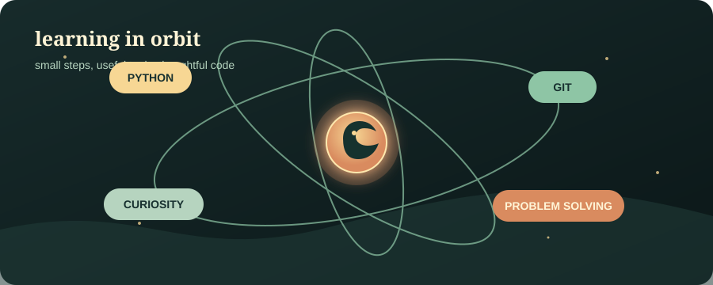

## Hello, I'm Haekal Rizqi

I am a curious developer building a strong foundation in software development one useful project at a time.

🌱 Currently learning **Python** and exploring how thoughtful code can solve everyday problems.

  

### What I am focusing on

- Writing clear, maintainable Python
- Learning through small, complete projects
- Growing my problem-solving fundamentals

### Find me online

[GitHub](https://github.com/KalRizz)